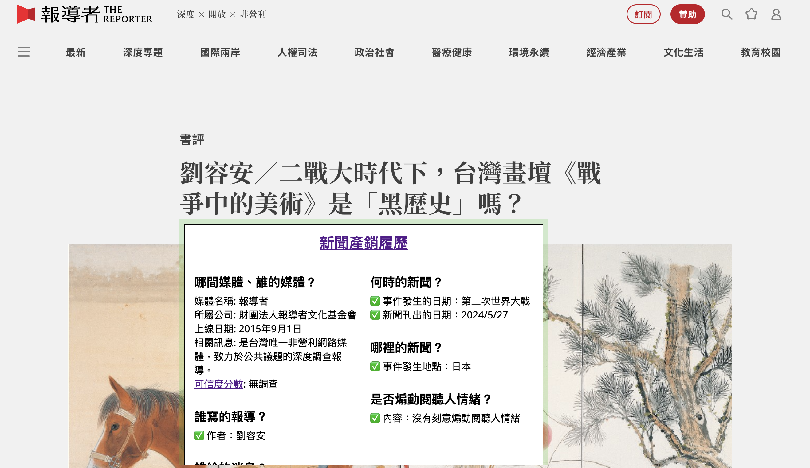
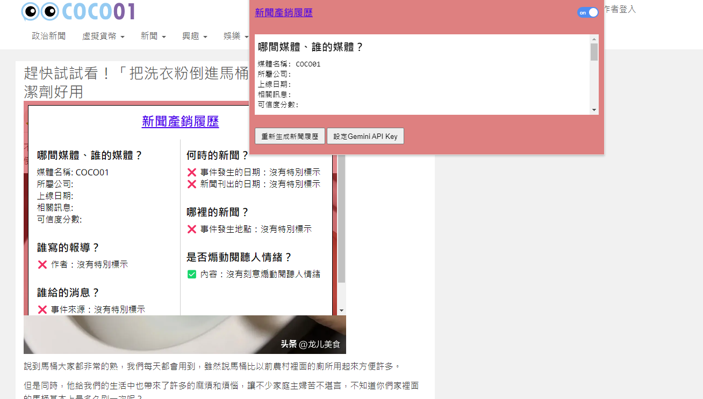
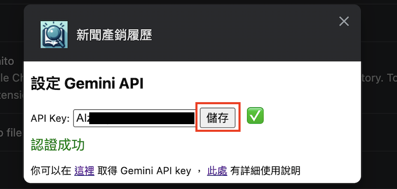
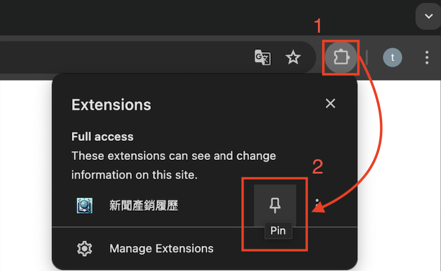
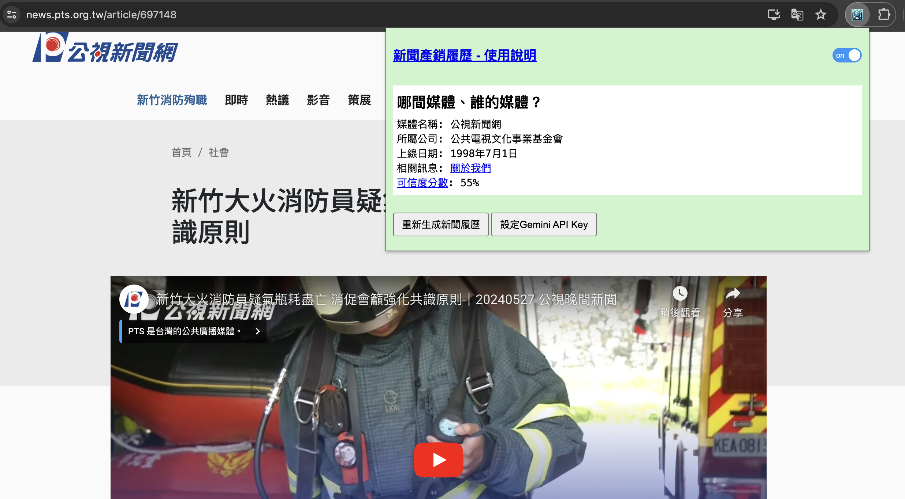
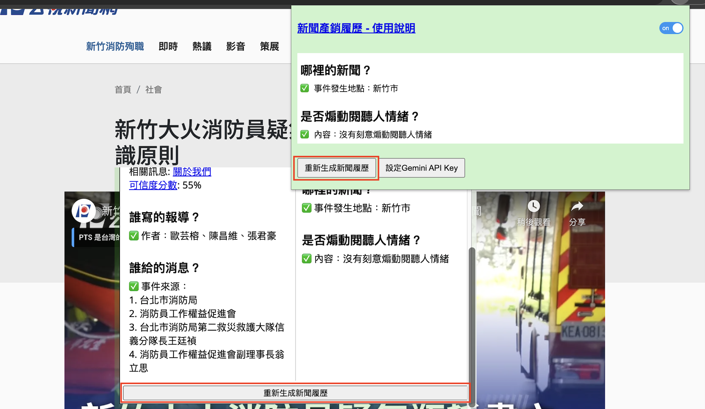

# 新聞產銷履歷

## ==**本專案尚在開發中**==

> **聲明：**  
> **本插件是使用大型語言模型進行判讀新聞內容，有可能將新聞資訊擷取錯誤，僅供參考，造成不便敬請見諒。**  
> **本專案無任何政治立場，如有偏頗或錯誤，請不吝指正。**

在閱覽新聞時，能利用本插件快速做出假新聞破解六步驟：

- [x] 哪間媒體報導的？  
- [x] 媒體的擁有者／經營者？  
- [x] 誰寫的報導？  
- [x] 消息從哪來的？  
- [x] 新聞的新鮮度 (何時的新聞) ？  
- [x] 新聞事發的地點？

還能利用AI判讀是否有煽動情緒用字、媒體黑/白名單（以紅、綠色表示），讓使用者可以快速判斷新聞的可信度。  
實際使用畫面如下，將滑鼠移動到標題或是點選extension圖標即可顯示新聞履歷：

## 使用說明

1. 安裝軟體後會跳到 option 頁面，先到 [Google AI Studio](https://aistudio.google.com/app/apikey) 建立 API Key (如下圖)，接著將 API Key 輸入後按儲存即可使用。

     建立 API Key - 1](docs/assets/step-1.png)
     建立 API Key - 2](docs/assets/step-2.png)
     建立 API Key - 3](docs/assets/step-3.png)
     建立 API Key - 4](docs/assets/step-4.png)
     建立 API Key - 5](docs/assets/step-5.png)
    

2. (可選) 可點擊視窗右上角的插件圖示，即會顯示新聞履歷的圖標，可將其釘選在瀏覽器上方，方便使用。

    

3. 點擊圖標，會顯示一個方框，將由上角的開關開啟

    

4. 重新載入新聞網頁，將滑鼠移動到標題或是點選extension圖標即可顯示新聞履歷

    
    

5. 點擊標題或extension圖標方框最下方的重新生成新聞履歷，即可重新生成

    

> 方框顏色會根據[黑白名單](./database/brand-certification.json)顯示 (參照記者真心話中的推薦名單) ，紅色表示黑名單，綠色表示白名單，灰色表示未列入名單

## TODO

- [ ] **建立新聞台資料庫-完善內文**
- [ ] **找到新聞中的重要資訊-自訂義黑、白名單**
- [ ] **建立假新聞資料庫**：利用台灣事實查核中心 / MyGoPen / Cofact / LINE FACT CHECKER 上已經證實錯誤的資料，以Chat-GPT4 API爬遍各大媒體新聞，若是有錯誤資料就將報導存入資料庫，並在搜尋頁中將其使用紅字標示
- [ ] **找尋與新聞內容相左的資訊**：讓 Gemini API 發想搜尋詞，再篩選出搜尋結果中與新聞內容相左的資訊，將其顯示在網頁上
- [ ] **可視化新聞履歷-給分**
- [ ] **解決在解析網站時會一起讀到旁邊的其他推薦新聞**

## [專案紀錄與規劃](./docs/專案紀錄與規劃.md)

## 資料搜集

1. [《記者真心話》媒體素養 君竹講給你聽](https://youtube.com/playlist?list=PLhfj29-zn1-WuHpt_zsaQmTljob8nMRhq&feature=shared)
2. [維基百科:網路媒體列表](https://zh.wikipedia.org/zh-tw/%E7%B6%B2%E8%B7%AF%E5%AA%92%E9%AB%94%E5%88%97%E8%A1%A8)
3. [維基百科:媒體列表](https://zh.wikipedia.org/zh-tw/Wikipedia:%E5%AA%92%E9%AB%94%E5%88%97%E8%A1%A8)

## License

本專案採用 [MIT LICENSE](LICENSE)。
